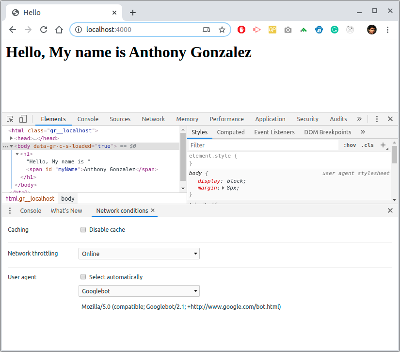

# Prerender Boilerplate

An Express boilerplate to start SEO serivces with Prerender.io for SPA and PWA.

In this setup, the prerender service engine works differently from our site i.e based on express. Normally, the express fetches site from public folder. On the event of a BOT requesting a page from the express server, the `prerender-node` modules reverts the request to prerender engine running on `http://localhost:3000/render?url=`

## Installation

Install node packages
```bash
npm install
```

Start the server
```bash
npm start
```

- Open the browser and Go to http://localhost:4000/. 
- Open developer Tools and in More tools, open Network Conditions. <center></center>
- Uncheck 'Select Automaticallly' for User Agent and select 'Googlebot' from the dropdown.
- Refresh the page and Check, the id `myName` that was generated via JavaScript is static and the JavaScript bits are removed automatically.
